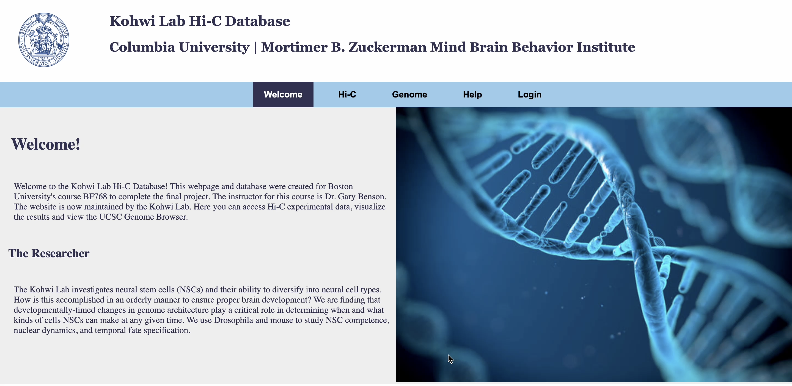

# Hi-C-SQL-Database
This repository contains the source code for the Kohwi Lab Hi-C Database, a searchable and interactive platform for exploring Hi-C interaction data generated by the Kohwi Lab at Columbia University. This project was developed as part of Boston University’s graduate-level bioinformatics course BF768: Biological Database Systems.

The database and accompanying Flask web application allow users to browse experiment metadata and generate custom Hi-C plots using pyGenomeTracks, based on user-specified genes or genomic regions. While no raw experimental data is included, the repository provides all code necessary to set up and run the database locally, including the backend (Flask and MariaDB), front-end HTML templates, and plotting scripts.

This project was developed collaboratively by four students in the Boston University Master of Science in Bioinformatics program:

Sofiya Patra

Dhruvi Joshi

Katie Kitrick

Sydney Sorbello

We hope this platform can be a useful tool for the Kohwi Lab’s ongoing research and a model for organizing and visualizing high-dimensional genomics data.

### Website Functionality

#### Homepage 
The homepage contains some general information about the lab and its research. 

### Hi-C Tab 
The Hi-C tab is the main interface between the SQL database and the user. Here the user can extract data from one experiment or compare two experiments based on gene name or gene location. 

The user can also visualize the Hi-C data for a particular gene or region on a heatmap plot. 

### Genome Browser Tab
The genome browser tab allows the user to navigate an external UCSC genome browser with a gene name or region of interest. 

### Login Tab 

