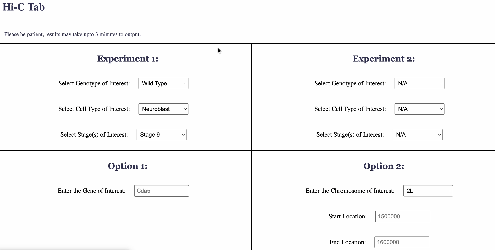

# Hi-C-SQL-Database
This repository contains the source code for the Kohwi Lab Hi-C Database, a searchable and interactive platform for exploring Hi-C interaction data generated by the Kohwi Lab at Columbia University. This project was developed as part of Boston University’s graduate-level bioinformatics course BF768: Biological Database Systems.

The database and accompanying Flask web application allow users to browse experiment metadata and generate custom Hi-C plots using pyGenomeTracks, based on user-specified genes or genomic regions. While no raw experimental data is included, the repository provides all code necessary to set up and run the database locally, including the backend (Flask and MariaDB), front-end HTML templates, and plotting scripts.

This project was developed collaboratively by four students in the Boston University Master of Science in Bioinformatics program:

Sofiya Patra

Dhruvi Joshi

Katie Kitrick

Sydney Sorbello

We hope this platform can be a useful tool for the Kohwi Lab’s ongoing research and a model for organizing and visualizing high-dimensional genomics data.

### Website Functionality
In lieu of a live site, below are screenshots illustrating key features. [Click here to watch a full demo of the Hi-C database]([https://drive.google.com/your_shared_link_here](https://drive.google.com/file/d/1DKp1AD3goDffBIloDLpOnwyTYixeOVYX/view))

#### Homepage 
The homepage contains some general information about the lab and its research. 

### Hi-C Tab 
The Hi-C tab is the main interface between the SQL database and the user. Users can extract interaction data from one experiment or compare two experiments based on gene name or genomic coordinates.

Query results are displayed in a downloadable table:

Users can also visualize Hi-C interaction maps as heatmaps for the selected region or gene:

### Genome Browser Tab
This tab allows users to navigate to an external UCSC Genome Browser instance, using either a gene name or genomic region of interest.

### Login Tab 
The login functinality allows the lab to keep somethings accessible only to users with the login information. 

Behind the login, the lab members are able to upload new data, add notes to a lab notes display, and view the experiments currently included in the database.

Lab memebers are also able to delete certain experiments from the database after logging in. 

